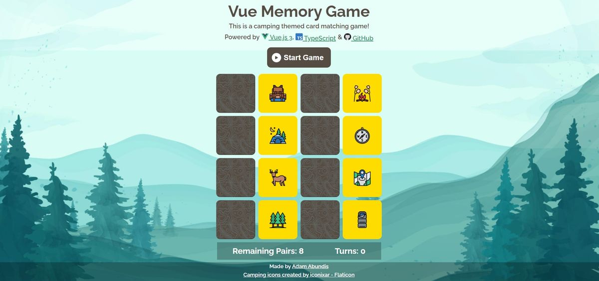

<div id="top"></div>

# Vue Memory Card Matching Game

[](https://vuejs.org/)
[](https://www.typescriptlang.org/)
[](https://github.com/abuna1985/vue-memory-game/commits/)
[](https://github.com/abuna1985/vue-memory-game/stargazers/)
[](https://github.com/abuna1985/vue-memory-game/watchers/)
[](https://opensource.org/licenses/MIT)
<br>

<div align="center">
  <a href="https://abuna1985.github.io/vue-memory-game/">
    
  </a>

  <h3 align="center">Vue Memory Card Matching Game</h3>

  <p align="center">
    <a href="https://abuna1985.github.io/vue-memory-game/">View Demo</a>
  </p>
</div>

## About The Project
<br>




This is a memory card matching game that showcases my mastery of Vue.js (version 3) and TypeScript. This is based off a tutorial from @bencodezen [peek-a-vue project](https://github.com/bencodezen/peek-a-vue). 

I also added the following to my project:

* TypeScript Declarations
* Camping theme for the cards and background image
* Web Accessibility
  * Made the back of the cards `<button>` elements so they can be accessed by the keyboard (`tab` and `shift + tab`)
  * The card button default state is `disabled` until the `Start Game` button is clicked
* Additional State
  * Displaying the total number of `turns` the player takes to to complete the game.

<a href="#top">back to top</a>

## How to play

First, you must press the `Start Game` button.

The game board consists of sixteen cards arranged randomly in a 4x4 grid. The deck is made up of eight different pairs of camping themed cards. Each turn:

* A player flips one card over to reveal its underlying image
* The player then turns over a second card, trying to find the corresponding card with the same symbol
* If the cards match, both cards stay flipped over
* If the cards do not match, both cards are returned to their initial hidden state
* The game ends once all cards have been correctly matched (with a fun surprise)

<a href="#top">back to top</a>

## Getting Started

### Installation

1. Clone the repo
    ```sh
    git clone https://github.com/abuna1985/vue-memory-game.git
    ```
2. Install NPM packages
    ```sh
    npm install
    ```
3. Run develop environment  (compiles and hot-reloads)
    ```sh
    npm run serve
    ```
### Deployment

1. Create production build (Compiles and minifies to HTML/CSS/JavaScript)
    ```sh
    npm run build
    ```
2. Create `gh-pages` branch (only needs to done once)
    ```sh
    git branch gh-pages
    ```
3. move the contents of the `dist` folder to the `gh-pages` branch
    ```sh
    npm run deploy
    ```
### Run Unit Tests
```sh
npm run test:unit
```
### Lints And Fix Files
```sh
npm run lint
```
### Customize Configuration
See [Configuration Reference](https://cli.vuejs.org/config/).

<a href="#top">back to top</a>

## Usage

<details>
    <summary><strong>Click here to see a desktop screenshot of the game</strong></summary>
    <h4>Desktop Screenshot of the Vue Memory Game</h4>
    
</details>
<br>
<details>
    <summary><strong>Click here to see a mobile screenshot of the game</strong></summary>
    <h4>Mobile Screenshot of the Vue Memory Game</h4>
    
</details>

<a href="#top">back to top</a>

## Roadmap

- [ ] Add Toggle button to switch to a 2nd theme
- [ ] A choice of grids before the games start
  - [x] 4x4
  - [ ] 4x5
  - [ ] 4x6

<a href="#top">back to top</a>

## License

Distributed under the MIT License. See `LICENSE.txt` for more information.

<a href="#top">back to top</a>)

## Contact

Adam Abundis - [@adamabundis](https://twitter.com/adamabundis) - adamjabundis@gmail.com

Demo Link: [https://abuna1985.github.io/vue-memory-game/](https://abuna1985.github.io/vue-memory-game/)

<a href="#top">back to top</a>

## Acknowledgments

* [Vue.js v3 documentation](https://vuejs.org/)
* [@bencodezen - Peek A Vue repo](https://github.com/bencodezen/peek-a-vue)
* [Youtube - Peek A Vue](https://youtu.be/WQa9-4K3me4)
* [Youtube- Modus Create - Vue 3 Hooks and Type Safety with TypeScript](https://youtu.be/aJdi-uEKYAc)
* [Youtube - Leveraging Types with TypeScript – Kirk Shillingford – Virtual Coffee Brownbag](https://youtu.be/IDLwHFwgNY4)

<a href="#top">back to top</a>
